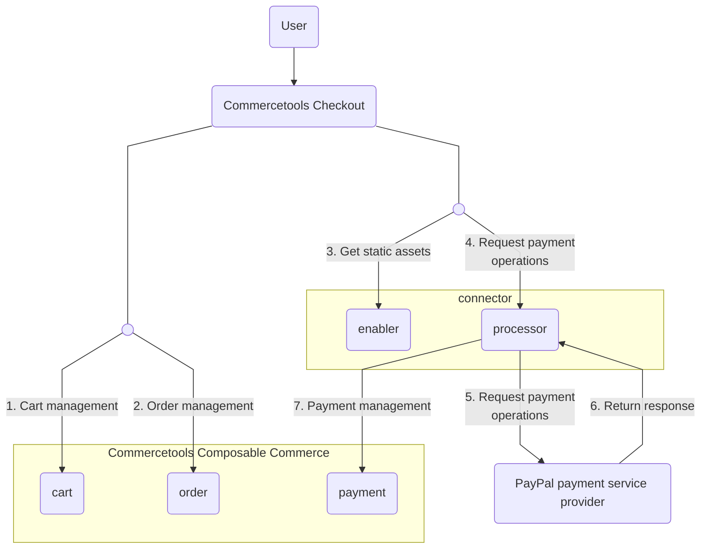

# connect-payment-integration-paypal
This repository provides a [connect](https://docs.commercetools.com/connect) for integration to PayPal payment service provider (PSP).

## Features
- Typescript language supported.
- Uses Fastify as web server framework.
- Uses [commercetools SDK](https://docs.commercetools.com/sdk/js-sdk-getting-started) for the commercetools-specific communication.
- Uses [connect payment SDK](https://github.com/commercetools/connect-payments-sdk) to manage request context, sessions and JWT authentication.
- Includes local development utilities in npm commands to build, start, test, lint & prettify code.

## Overview
The PayPal integration connector contains two modules:  
- Enabler: Acts as a wrapper implementation in which frontend components from PayPal embedded. It gives control to checkout product on when and how to load the connector frontend based on business configuration. In cases connector is used directly and not through Checkout product, the connector library can be loaded directly on frontend than the PSP one.
- Processor: Acts as backend services which is middleware to integrate with PayPal platform. It is mainly responsible for managing transactions with PayPal and updating payment entity in composable commerce.  `connect-payment-sdk` will be offered to be used in connector to manage request context, sessions and other tools necessary to transact.



1. commercetools Checkout in front-end side sends requests to composable commerce for cart creation.
2. commercetools Checkout retrieves SDK as static assets from enabler in connector.
3. After downloading the SDK, commercetools Checkout sends request via the SDK to endpoints exposed by processor for various payment operations.
4. The processor transforms the received request and send them to PayPal platform.
5. PayPal processes the payment operations and return the response to processor.
6. The processor handles the payment persistence to composable commerce, and return the result to front-end.
7. commercetools Checkout handles the order management in composable commerce once it receives the result from the processor. 

## Prerequisite
#### 1. commercetools composable commerce API client
Users are expected to create API client responsible for payment management in composable commerce project. Details of the API client are taken as input as environment variables/ configuration for connect such as `CTP_PROJECT_KEY` , `CTP_CLIENT_ID`, `CTP_CLIENT_SECRET`. For details, please read [Deployment Configuration](./README.md#deployment-configuration).
In addition, please make sure the API client should have enough scope to be able to manage payment. For details, please refer to [Running Application](./processor/README.md#running-application)

#### 2. various URLs from commercetools composable commerce
Various URLs from commercetools platform are required to be configured so that the connect application can handle session and authentication process for endpoints.
Their values are taken as input as environment variables/ configuration for connect with variable names `CTP_API_URL`, `CTP_AUTH_URL` and `CTP_SESSION_URL`.

#### 3. Paypal account credentials
Various account data provided by Paypal are necessary to be configured so that the requests from the connect application can be authenticated by Paypal platform within the integration.
Their values are taken as input as environment variables/ configuration for connect with variable names `PAYPAL_ENVIRONMENT`, `PAYPAL_CLIENT_ID`, `PAYPAL_WEBHOOK_ID`, `PAYPAL_CLIENT_SECRET`.

## Getting started
The template contains two modules :  
- Enabler: Acts as a wrapper implementation in which frontend components from PSPs embedded. It gives control to checkout product on when and how to load the connector frontend based on business configuration. In cases connector is used directly and not through Checkout product, the connector library can be loaded directly on frontend than the PSP one.
- Processor : Acts as backend services which is middleware to 3rd party PSPs to be responsible for managing transactions with PSPs and updating payment entity in composable commerce.  `connect-payment-sdk` will be offered to be used in connector to manage request context, sessions and other tools necessary to transact.

Regarding the development of processor module, please refer to the following documentations:
- [Development of Processor](./processor/README.md)

#### 1. Register as connector in commercetools Connect
Follow guidelines [here](https://docs.commercetools.com/connect/getting-started) to register the connector for public/private use.

## Deployment Configuration
In order to deploy your customized connector application on commercetools Connect, it needs to be published. For details, please refer to [documentation about commercetools Connect](https://docs.commercetools.com/connect/concepts)
In addition, in order to support connect, the tax integration connector template has a folder structure as listed below
```
├── enabler
│   ├── src
│   ├── test
│   └── package.json
├── processor
│   ├── src
│   ├── test
│   └── package.json
└── connect.yaml
```

Connect deployment configuration is specified in `connect.yaml` which is required information needed for publishing of the application. Following is the deployment configuration used by enabler and processor modules
```
deployAs:
  - name: enabler
    applicationType: assets
  - name: processor
    applicationType: service
    endpoint: /
    configuration:
      standardConfiguration:
        - key: CTP_PROJECT_KEY
          description: Commercetools project key
          required: true
        - key: CTP_CLIENT_ID
          description: Commercetools client ID
          required: true
        - key: CTP_AUTH_URL
          description: commercetools Auth URL
          required: true
          default: https://auth.europe-west1.gcp.commercetools.com
        - key: CTP_API_URL
          description: commercetools API URL
          required: true
          default: https://api.europe-west1.gcp.commercetools.com
        - key: CTP_SESSION_URL
          description: Session API URL
          required: true
          default: https://session.europe-west1.gcp.commercetools.com
        - key: CTP_JWKS_URL
          description: JWKs url
          required: true
          default: https://mc-api.europe-west1.gcp.commercetools.com/.well-known/jwks.json
        - key: CTP_JWT_ISSUER
          description: JWT Issuer for jwt validation
          required: true
          default: https://mc-api.europe-west1.gcp.commercetools.com
        - key: PAYPAL_CLIENT_ID
          description: Paypal client ID
          required: true
        - key: PAYPAL_WEBHOOK_ID
          description: Paypal webhook ID
          required: true
        - key: PAYPAL_ENVIRONMENT
          description: Payment environment (live/test)
          required: true
      securedConfiguration:
        - key: CTP_CLIENT_SECRET
          description: Commercetools client secret
          required: true
        - key: PAYPAL_CLIENT_SECRET
          description: Paypal client secret
          required: true
```

Here you can see the details about various variables in configuration
- CTP_PROJECT_KEY: The key of commercetools composable commerce project.
- CTP_CLIENT_ID: The client ID of your commercetools composable commerce user account. It is used in commercetools client to communicate with commercetools composable commerce via SDK.
- CTP_CLIENT_SECRET: The client secret of commercetools composable commerce user account. It is used in commercetools client to communicate with commercetools composable commerce via SDK.
- CTP_AUTH_URL: The URL for authentication in commercetools platform. It is used to generate OAuth 2.0 token which is required in every API call to commercetools composable commerce. The default value is `https://auth.europe-west1.gcp.commercetools.com`. For details, please refer to documentation [here](https://docs.commercetools.com/tutorials/api-tutorial#authentication).
- CTP_API_URL: The URL for commercetools composable commerce API. Default value is `https://api.europe-west1.gcp.commercetools.com`.
- CTP_SESSION_URL: The URL for session creation in commercetools platform. Connectors relies on the session created to be able to share information between enabler and processor. The default value is `https://session.europe-west1.gcp.commercetools.com`.
- CTP_JWKS_URL: The URL which provides JSON Web Key Set.
- CTP_JWT_ISSUER: The issuer inside JSON Web Token which is required in JWT validation process. Default value is `https://mc-api.europe-west1.gcp.commercetools.com`
- PAYPAL_ENVIRONMENT: The indicator of Paypal environment.  Default value is `TEST`. It can be configured either as `LIVE` or `TEST`.
- PAYPAL_CLIENT_ID: The unique identifier of a PayPal account.
- PAYPAL_CLIENT_SECRET: It is used to authenticate a PayPal client ID. Both ID and secret are required to obtain access token for PayPal API calls. For details, please refer to [Get started with PayPal REST APIs](https://developer.paypal.com/api/rest/)
- PAYPAL_WEBHOOK_ID: It represents unique identifier of a notification event from PayPal platform.